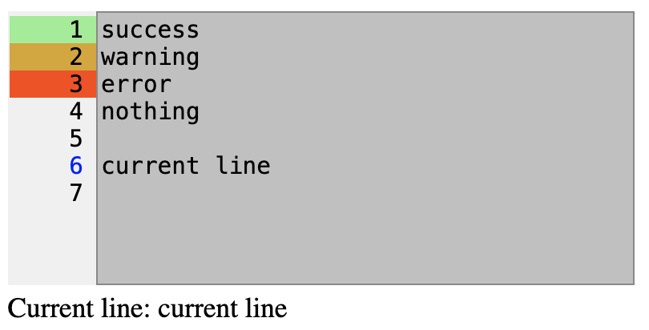

This jQuery plugin will convert a <textarea> element to a textarea element with a line number gutter on the left.

This plugin allows to color the background of each line number based on classes returned from a callback function's value. Usefull for validating line based texts.

Also it's possible to see at which line the cursor is. This can be used to show use text if there is an error on a line. Or to decode the raw test in more useful use text.

The code is based [https://github.com/pgooch/jQueryLinenNumbersPlugin](https://github.com/pgooch/jQueryLinenNumbersPlugin) by Phillip Gooch.


## Example

```html
<!DOCTYPE html>
<head>
    <link rel="stylesheet" href="jquery.textarea-with-linenumbers.css">
    <style>
        textarea {
            background: #c0c0c0;
            border: 1px solid #888;
            resize: none;
            width: 350px;
            height: 150px;
        }
        div.message {
            height: 30px;
        }
    </style>
    <script src="https://ajax.googleapis.com/ajax/libs/jquery/3.5.1/jquery.min.js"></script>
    <script src="jquery.textarea-with-linenumbers.js"></script>
</head>

<body>

    <div class="linenumbers-wrapper">
        <textarea></textarea>
        <div class="message"></div>
    </div>

    <script>
        $('textarea').linenumbers({
            'col_width': '50px',
            lineValidatorCallback: function (obj, idx, line, current_line) {
                if (current_line && line) {
                    $(obj).parent().find('.message').html('Current line: ' + line);
                }
                if (line == 'warning')
                    return 'warning';
                else if (line == 'error')
                    return 'error';
                else if (line == 'success')
                    return 'success';
                return 0;
            }
        });

    </script>

</body>

</html>
```

## Output with some highlights




